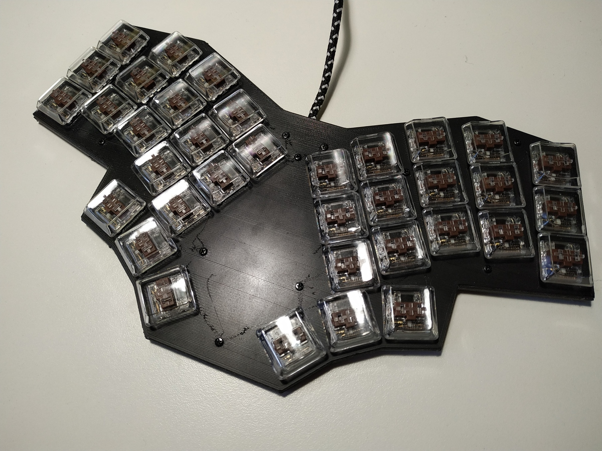
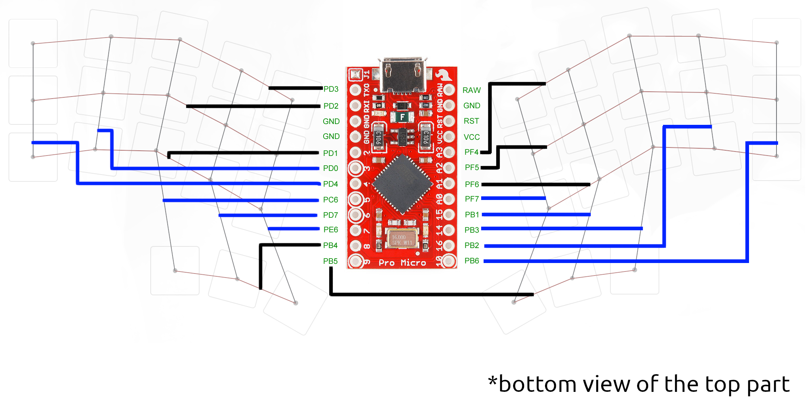

# bolek

36% keyboard designed to go with kailh chocs and pro micro

# build

## wiring pro micro

# firmware

[QMK](https://github.com/qmk/qmk_firmware/tree/master/keyboards/handwired/bolek) is oficially supported.
